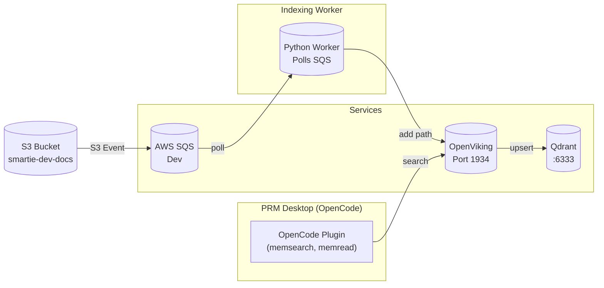
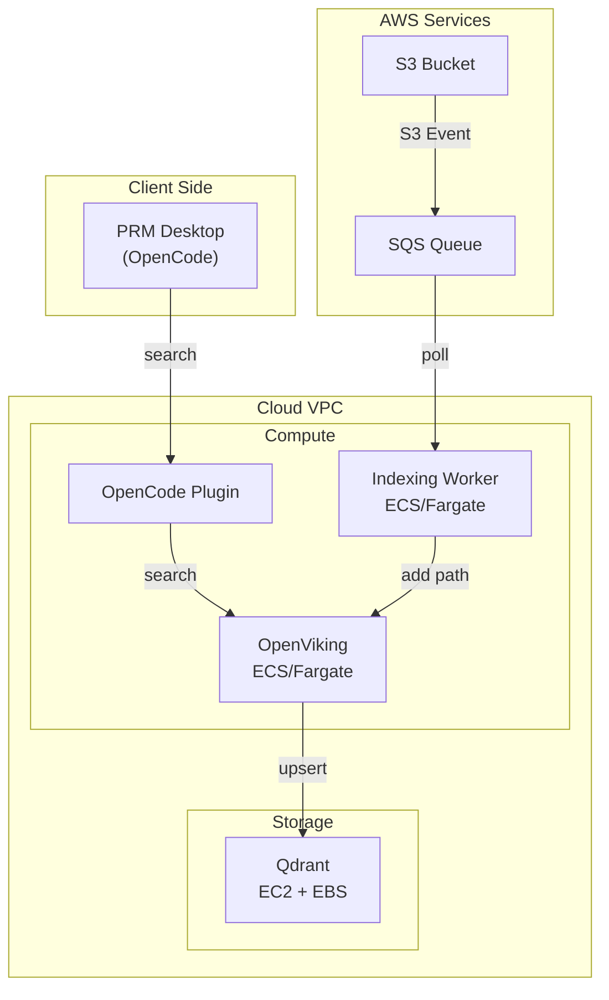

# SMARTIE PRM - MVP1 Solution Design

## 1. Overview

**Project**: SMARTIE PRM (Priority Relationship Management)  
**Version**: MVP1  
**Objective**: Develop an enterprise-wide Priority Relationship Management system. For MVP1, user `sonln4@sonle161290gmail.onmicrosoft.com` is designated as the UAT test user representing the broader enterprise rollout. The system enables users to log in via Microsoft Entra ID and perform AI-driven QnA on enterprise knowledge bases and local files.

---

## 2. Architecture

SMARTIE PRM uses a simplified architecture with direct OpenCode + OpenViking integration:

### Search Flow (Direct)
- PRM Desktop (OpenCode) → **OpenCode Plugin** → OpenViking → Qdrant

The OpenCode plugin directly calls OpenViking's search API, bypassing the MCP server layer. This follows the [OpenViking Memory Plugin](https://github.com/volcengine/OpenViking/blob/main/examples/opencode-memory-plugin/README.md) pattern.

### Indexing Flow (Event-Driven)
- Documents uploaded to S3 → SQS event → Indexing Worker → OpenViking → Qdrant

### Components

| Component | Description |
|-----------|-------------|
| **PRM Desktop (OpenCode)** | User-facing frontend. Uses OpenCode plugin for direct OpenViking search. |
| **OpenCode Plugin** | Direct integration with OpenViking's search API (`memsearch`, `memread`, etc.) |
| **OpenViking Server** | Handles `add_resource` indexing and `search` query evaluation |
| **Qdrant Vector DB** | Storage backend for persisting dense vectors |
| **Indexing Worker** | Polls SQS for S3 events, pushes file paths to OpenViking |

---

## 3. Architecture Diagrams

### Development Environment (Local)



### Production Environment (Cloud Deployment)



---

## 4. Repository Structure

```
smartie_prm/
├── opencode.json                         # OpenCode config with plugin
│
├── openviking/                           # OpenCode plugin for direct search
│   ├── plugin/                           #   TypeScript plugin
│   │   ├── openviking-memory.ts         #     Main plugin (adapted from example)
│   │   └── openviking-config.json       #     Plugin config
│   └── sync.py                          #   Python sync client
│
├── enterprise_service/                   # Knowledge Service
│   ├── indexing_worker/                  #   SQS consumer → OpenViking
│   │   ├── worker.py                    #     Main worker
│   │   └── config.py                   #     Config
│   ├── openviking_configs/              #   OpenViking configs
│   │   ├── local_dev.conf               #     Dev environment
│   │   └── cloud_prod.conf              #     Production
│   ├── setup_aws_dev.sh                #   AWS setup
│   └── upload_test_data.sh             #   Test data upload
│
└── docs/                                # Documentation
    └── SOLUTION_DESIGN.md
```

---

## 5. OpenCode Plugin

The OpenCode plugin provides direct access to OpenViking's search capabilities:

### Available Tools
- `memsearch` - Search across memories, resources, skills
- `memread` - Read content from URI
- `membrowse` - Browse filesystem structure
- `memcommit` - Trigger memory extraction

### Configuration
```json
{
  "endpoint": "http://localhost:1934",
  "apiKey": "your-openviking-api-key",
  "enabled": true
}
```

---

## 6. Success Criteria

1. ✅ OpenCode directly integrates with OpenViking via plugin for search
2. ✅ S3 document uploads trigger SQS events that Indexing Worker processes
3. ✅ OpenViking handles all semantic intelligence (embedding, parsing)
4. ✅ Qdrant serves as the vector database backend
5. ✅ Simplified architecture - no MCP server layer for MVP1
